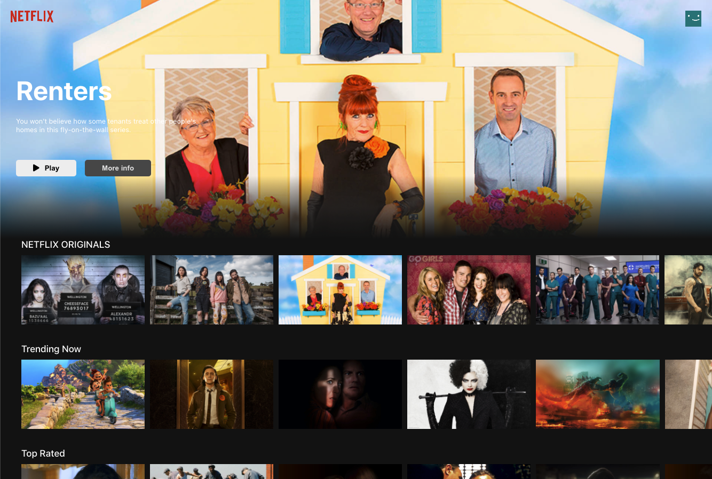
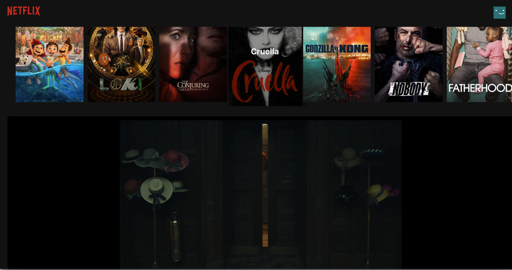
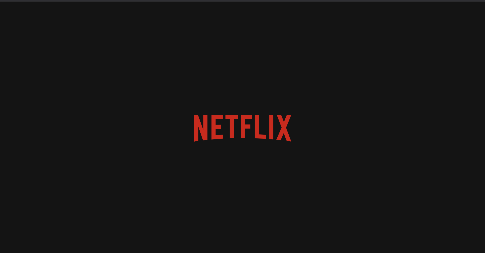

## Project Link

You can try the project.
Project Link: <https://nexfilx-clone.web.app/>

# Netflix clone

Simple Netflix clone website.

## Technologies

- React
- styled-components
- Firebase
- API(TMDb API)

## Description

- Project looks like this!
  <br/>
  
- If you click an image, it opens up a trailer that will come youtube.
  (If you click the image again you can close it.)
  <br/>
  
- Loading page
  <br/>
  

## Setup

To run this project, install it locally using npm:

1. Clone the repo

```bash
git clone https://github.com/Globalkmaria/netflix_clone.git
```

2. Go into the folder

```bash
cd netflix_clone
```

3. Install NPM packages

```bash
npm i
```

4. Start server

```bash
npm start
```

## Inspiration

This app was inspired by [Clever Programmer](https://youtu.be/XtMThy8QKqU)(Youtube channel). But there were changes(getting random movie for banner but just the ones that has img, banner button, etc.).
